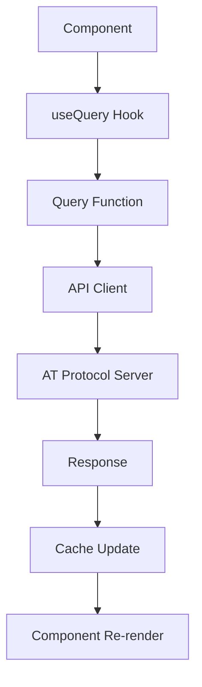

# Bluesky React Native アーキテクチャ学習ガイド

## 📚 学習目的
このドキュメントは、Bluesky React Nativeアプリケーションのアーキテクチャを深く理解するための学習ガイドです。
大規模なReact Nativeアプリケーションの設計パターン、状態管理、パフォーマンス最適化を学習できます。

## 🏗️ 全体アーキテクチャ

### レイヤー構造
```
┌─────────────────────────────────────────────────────┐
│                 UI Layer (View)                     │
├─────────────────────────────────────────────────────┤
│              Screen Components                      │
├─────────────────────────────────────────────────────┤
│               Business Logic                        │
├─────────────────────────────────────────────────────┤
│            State Management Layer                   │
├─────────────────────────────────────────────────────┤
│               API Client Layer                      │
├─────────────────────────────────────────────────────┤
│              Platform Abstraction                   │
└─────────────────────────────────────────────────────┘
```

### 主要な設計原則
1. **関心の分離**: UI、ビジネスロジック、データ層の明確な分離
2. **単方向データフロー**: Redux-likeな状態管理パターン
3. **プラットフォーム抽象化**: iOS/Android/Webの差異を隠蔽
4. **コンポーネントベース**: 再利用可能なUIコンポーネント
5. **型安全性**: TypeScriptによる静的型チェック

## 📂 ディレクトリ構造と学習ポイント

### `/src/state/` - 状態管理の学習
グローバル状態管理の実装パターンを学習

**主要ファイル**:
- `session/`: マルチアカウント認証システム
- `queries/`: TanStack Queryによるサーバー状態管理
- `shell/`: UI状態（ドロワー、タブ、アニメーション）
- `geolocation/`: GPS・位置情報管理

**学習ポイント**:
```typescript
// React Query + Zustand の組み合わせパターン
const useSession = () => {
  // サーバー状態: React Query
  const {data: profile} = useProfileQuery()
  
  // クライアント状態: Zustand
  const {currentAccount} = useSessionStore()
  
  return {profile, currentAccount}
}
```

### `/src/components/` - UIコンポーネント設計
デザインシステムとコンポーネント設計パターンを学習

**学習ポイント**:
1. **Compound Component パターン**: 柔軟なAPIの設計
2. **Render Props**: ロジックとUIの分離
3. **Forward Ref**: refの適切な転送
4. **Polymorphic Component**: 複数の要素タイプをサポート

```typescript
// Compound Component の例（Button.tsx）
<Button>
  <Button.Text>Submit</Button.Text>
  <Button.Icon icon={ArrowRight} />
</Button>

// Polymorphic Component の例
<Text as="h1" size="xl">タイトル</Text>
<Text as="p" size="md">本文</Text>
```

### `/src/lib/` - ユーティリティライブラリ
再利用可能なロジックとヘルパー関数の学習

**主要カテゴリ**:
- **API通信**: HTTPクライアント、エラーハンドリング
- **非同期処理**: Promise、async/await パターン
- **文字列処理**: バリデーション、フォーマット
- **ルーティング**: ナビゲーション抽象化

## 🔄 状態管理フローの詳細

### 1. サーバー状態管理 (TanStack Query)


**実装例**:
```typescript
// src/state/queries/profile/index.ts
export function useProfileQuery(did: string) {
  return useQuery({
    queryKey: ['profile', did],
    queryFn: () => api.getProfile(did),
    staleTime: 5 * 60 * 1000, // 5分間キャッシュ
    cacheTime: 30 * 60 * 1000, // 30分間保持
  })
}
```

### 2. クライアント状態管理 (Zustand)
```typescript
// src/state/session/index.ts
export const useSessionStore = create<SessionState>()(
  persist(
    (set, get) => ({
      accounts: [],
      currentAccount: null,
      
      // アクション
      addAccount: (account) =>
        set((state) => ({
          accounts: [...state.accounts, account],
        })),
        
      switchAccount: (did) =>
        set((state) => ({
          currentAccount: state.accounts.find(a => a.did === did),
        })),
    }),
    {
      name: 'session-storage',
      storage: mmkvStorage, // React Native MMKV
    }
  )
)
```

## 🎨 デザインシステム (Alf)

### テーマシステム
```typescript
// src/alf/themes.ts
export const lightTheme = {
  name: 'light',
  atoms: {
    bg: {backgroundColor: '#ffffff'},
    text: {color: '#000000'},
    border: {borderColor: '#e1e8ed'},
  }
}

// 使用例
const MyComponent = () => {
  const t = useTheme()
  return (
    <View style={[a.flex_1, t.atoms.bg]}>
      <Text style={[a.text_lg, t.atoms.text]}>
        Hello World
      </Text>
    </View>
  )
}
```

### レスポンシブデザイン
```typescript
// Breakpoint ベースのレスポンシブ対応
const styles = {
  container: [
    a.p_md,          // デフォルト: 16px padding
    gtMobile(a.p_lg), // タブレット以上: 24px padding
  ]
}
```

## 🌐 国際化 (i18n) パターン

### Lingui による多言語対応
```typescript
// 50+言語対応の実装
import {msg, Trans} from '@lingui/macro'
import {useLingui} from '@lingui/react'

const MyComponent = () => {
  const {_} = useLingui()
  
  return (
    <View>
      {/* 静的テキスト */}
      <Trans>Welcome to Bluesky</Trans>
      
      {/* 動的テキスト */}
      <Text>{_(msg`Hello ${name}`)}</Text>
    </View>
  )
}
```

### RTL (右から左) 言語サポート
```typescript
// アラビア語・ヘブライ語対応
const isRTL = I18nManager.isRTL
const styles = {
  container: {
    flexDirection: isRTL ? 'row-reverse' : 'row',
    textAlign: isRTL ? 'right' : 'left',
  }
}
```

## ⚡ パフォーマンス最適化パターン

### 1. React Compiler の活用
```typescript
// 自動メモ化による最適化
const ExpensiveComponent = ({data}) => {
  // React Compiler が自動的に useMemo/useCallback を挿入
  const processedData = processLargeData(data)
  
  return <ComplexView data={processedData} />
}
```

### 2. 仮想化リストの実装
```typescript
// 大量データの効率的な表示
import {FlashList} from '@shopify/flash-list'

const PostFeed = () => (
  <FlashList
    data={posts}
    renderItem={({item}) => <PostItem post={item} />}
    estimatedItemSize={120}
    getItemType={(item) => item.type} // アイテムタイプ別最適化
  />
)
```

### 3. 画像最適化
```typescript
// 段階的画像読み込み
const OptimizedImage = ({uri, width, height}) => (
  <Image
    source={{
      uri: `${uri}?w=${width}&h=${height}&f=webp`, // WebP変換
    }}
    placeholder={blurhash} // Blurhash placeholder
    transition={300} // フェードイン効果
  />
)
```

## 🔐 セキュリティパターン

### JWT トークン管理
```typescript
// src/state/session/agent.ts
class BskyAgent {
  private accessJwt: string | null = null
  private refreshJwt: string | null = null
  
  async refreshSession() {
    if (!this.refreshJwt) throw new Error('No refresh token')
    
    const response = await this.api.com.atproto.server.refreshSession({
      headers: {Authorization: `Bearer ${this.refreshJwt}`}
    })
    
    this.accessJwt = response.data.accessJwt
    this.refreshJwt = response.data.refreshJwt
    
    // セキュアストレージに保存
    await secureStorage.set('session', {
      accessJwt: this.accessJwt,
      refreshJwt: this.refreshJwt,
    })
  }
}
```

## 📱 プラットフォーム固有の実装

### ファイル拡張子による分岐
```typescript
// Button.native.tsx - iOS/Android実装
export const Button = ({onPress, children}) => (
  <TouchableOpacity onPress={onPress}>
    {children}
  </TouchableOpacity>
)

// Button.web.tsx - Web実装  
export const Button = ({onPress, children}) => (
  <button onClick={onPress}>
    {children}
  </button>
)
```

### プラットフォーム検出
```typescript
// src/platform/detection.ts
export const isIOS = Platform.OS === 'ios'
export const isAndroid = Platform.OS === 'android'
export const isWeb = Platform.OS === 'web'
export const isNative = isIOS || isAndroid

// 使用例
const styles = {
  container: {
    paddingTop: isIOS ? 44 : 24, // iOS セーフエリア対応
  }
}
```

## 🚀 実装のベストプラクティス

### 1. エラーハンドリング
```typescript
// グローバルエラー境界の実装
class GlobalErrorBoundary extends React.Component {
  componentDidCatch(error: Error, errorInfo: ErrorInfo) {
    // Sentry にエラーレポート
    Sentry.captureException(error, {
      tags: {component: 'GlobalErrorBoundary'},
      extra: errorInfo,
    })
  }
  
  render() {
    if (this.state.hasError) {
      return <ErrorScreen onRetry={this.handleRetry} />
    }
    
    return this.props.children
  }
}
```

### 2. テスト戦略
```typescript
// コンポーネントテストの例
import {render, screen} from '@testing-library/react-native'

test('Button コンポーネントが正しくレンダリングされる', () => {
  render(<Button onPress={mockFn}>Test Button</Button>)
  
  const button = screen.getByText('Test Button')
  expect(button).toBeTruthy()
  
  fireEvent.press(button)
  expect(mockFn).toHaveBeenCalled()
})
```

### 3. アクセシビリティ対応
```typescript
// WAI-ARIA準拠の実装
const AccessibleButton = ({onPress, children, disabled}) => (
  <TouchableOpacity
    onPress={onPress}
    disabled={disabled}
    accessible={true}
    accessibilityRole="button"
    accessibilityState={{disabled}}
    accessibilityHint="タップしてアクションを実行"
  >
    {children}
  </TouchableOpacity>
)
```

## 🎯 学習のネクストステップ

### 初級者向け
1. **基本的なコンポーネント作成**: `/src/components/` の簡単なコンポーネントを読解
2. **状態管理の理解**: `/src/state/shell/` から始める
3. **ナビゲーション**: `/src/Navigation.tsx` の構造理解

### 中級者向け
1. **TanStack Query**: `/src/state/queries/` の実装パターン学習
2. **デザインシステム**: `/src/alf/` のテーマシステム理解
3. **パフォーマンス最適化**: メモ化とリスト仮想化の実装

### 上級者向け
1. **AT Protocol**: 分散型プロトコルの実装詳細
2. **カスタムフック**: 複雑なロジックの抽象化パターン
3. **ネイティブモジュール**: プラットフォーム固有機能の実装

## 📖 参考リソース

### 公式ドキュメント
- [React Native](https://reactnative.dev/)
- [Expo](https://docs.expo.dev/)
- [TanStack Query](https://tanstack.com/query/)
- [Zustand](https://zustand-demo.pmnd.rs/)

### デザインパターン
- [React Patterns](https://reactpatterns.com/)
- [Component Composition](https://kentcdodds.com/blog/compound-components-with-react-hooks)
- [State Management Patterns](https://redux.js.org/style-guide/style-guide)

このガイドを通じて、モダンなReact Native開発の実践的なパターンとアーキテクチャを学習できます。