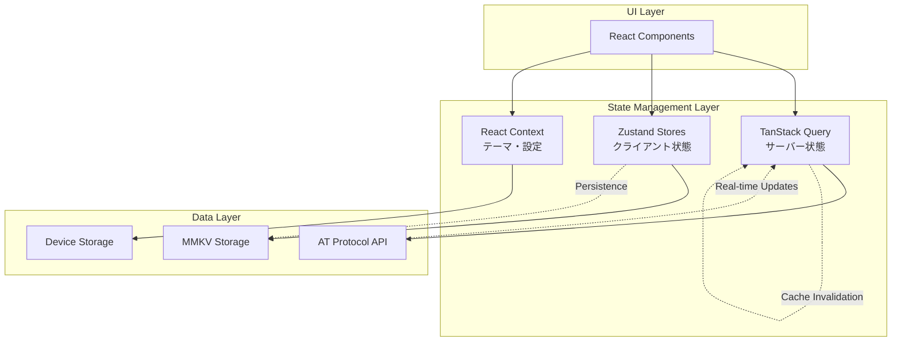

# Bluesky 状態管理完全ガイド

## 🎯 概要
このガイドでは、Blueskyアプリケーションの状態管理アーキテクチャを詳しく解説します。
TanStack Query + Zustand の組み合わせによる、モダンなReact Native状態管理パターンを学習できます。

## 📊 状態管理アーキテクチャ図



## 🏗️ 状態の分類と設計原則

### 1. サーバー状態 (TanStack Query)
**管理対象**: API から取得するデータ
- ユーザープロフィール情報
- 投稿・フィード データ
- 通知データ
- フォロー・フォロワー情報

**特徴**:
- キャッシュ機能
- 背景更新
- 楽観的更新
- エラーハンドリング

### 2. クライアント状態 (Zustand)
**管理対象**: アプリ内でのみ使用される状態
- 認証セッション
- UI状態（ドロワー開閉等）
- ユーザー設定
- 一時的な入力データ

**特徴**:
- 永続化対応
- 型安全性
- デバッグツール対応
- ミドルウェア機能

### 3. コンポーネント状態 (React Context)
**管理対象**: テーマやグローバル設定
- ダークモード/ライトモード
- 言語設定
- アクセシビリティ設定

## 🔄 サーバー状態管理 (TanStack Query)

### 基本的な実装パターン

#### プロフィール情報の取得
```typescript
// src/state/queries/profile/index.ts

/**
 * プロフィール情報取得クエリ
 * キャッシュ戦略: 5分間は新鮮、30分間保持
 */
export function useProfileQuery(did: string) {
  return useQuery({
    queryKey: ['profile', did],
    queryFn: async () => {
      const response = await getAgent().getProfile({actor: did})
      return response.data
    },
    staleTime: 5 * 60 * 1000, // 5分間キャッシュ
    cacheTime: 30 * 60 * 1000, // 30分間メモリ保持
    enabled: !!did, // did が存在する場合のみ実行
  })
}
```

#### 無限スクロール対応フィード
```typescript
// src/state/queries/post-feed/index.ts

/**
 * 無限スクロール対応の投稿フィード
 * ページネーション機能付き
 */
export function usePostFeedQuery(uri: string) {
  return useInfiniteQuery({
    queryKey: ['post-thread', uri],
    queryFn: async ({pageParam = undefined}) => {
      const response = await getAgent().getPostThread({
        uri,
        cursor: pageParam, // ページネーション用カーソル
      })
      return response.data
    },
    getNextPageParam: (lastPage) => lastPage.cursor,
    staleTime: 30 * 1000, // 30秒間新鮮
    cacheTime: 5 * 60 * 1000, // 5分間保持
  })
}
```

### 楽観的更新パターン

#### いいね機能の実装
```typescript
// src/state/queries/like/index.ts

export function useLikeMutation() {
  const queryClient = useQueryClient()
  
  return useMutation({
    mutationFn: async ({uri, like}: {uri: string; like: boolean}) => {
      if (like) {
        return await getAgent().like(uri)
      } else {
        return await getAgent().deleteLike(uri)
      }
    },
    
    // 楽観的更新: API呼び出し前にUIを更新
    onMutate: async ({uri, like}) => {
      await queryClient.cancelQueries(['post', uri])
      
      const previousPost = queryClient.getQueryData(['post', uri])
      
      queryClient.setQueryData(['post', uri], (old: any) => ({
        ...old,
        likeCount: like ? old.likeCount + 1 : old.likeCount - 1,
        viewer: {...old.viewer, like: like ? 'liked' : undefined},
      }))
      
      return {previousPost}
    },
    
    // エラー時のロールバック
    onError: (err, variables, context) => {
      if (context?.previousPost) {
        queryClient.setQueryData(['post', variables.uri], context.previousPost)
      }
    },
    
    // 成功時のキャッシュ更新
    onSettled: (data, error, variables) => {
      queryClient.invalidateQueries(['post', variables.uri])
    },
  })
}
```

### キャッシュ無効化戦略

#### 関連データの一括更新
```typescript
// src/state/queries/util.ts

/**
 * 関連するクエリキーを一括で無効化
 * 例: ユーザーがフォローした場合、プロフィール、フォローリスト、フィードを更新
 */
export function invalidateProfileQueries(queryClient: QueryClient, did: string) {
  queryClient.invalidateQueries(['profile', did])
  queryClient.invalidateQueries(['posts', did])
  queryClient.invalidateQueries(['followers', did])
  queryClient.invalidateQueries(['following', did])
  
  // フィードも無効化（新しいフォローによる投稿が表示される可能性）
  queryClient.invalidateQueries(['feed'])
}
```

## 🎛️ クライアント状態管理 (Zustand)

### セッション管理の実装

```typescript
// src/state/session/index.ts

interface SessionState {
  // 状態の型定義
  accounts: SessionAccount[]
  currentAccount: SessionAccount | null
  
  // アクションの型定義
  addAccount: (account: SessionAccount) => void
  removeAccount: (did: string) => void
  switchAccount: (did: string) => void
  clearSession: () => void
}

/**
 * セッション状態管理ストア
 * マルチアカウント対応、永続化機能付き
 */
export const useSessionStore = create<SessionState>()(
  persist(
    (set, get) => ({
      // 初期状態
      accounts: [],
      currentAccount: null,
      
      // アカウント追加
      addAccount: (account: SessionAccount) => {
        set((state) => {
          // 重複チェック
          const existingIndex = state.accounts.findIndex(a => a.did === account.did)
          
          if (existingIndex >= 0) {
            // 既存アカウントを更新
            const newAccounts = [...state.accounts]
            newAccounts[existingIndex] = account
            return {accounts: newAccounts}
          } else {
            // 新規アカウント追加
            return {accounts: [...state.accounts, account]}
          }
        })
      },
      
      // アカウント削除
      removeAccount: (did: string) => {
        set((state) => {
          const newAccounts = state.accounts.filter(a => a.did !== did)
          const newCurrentAccount = state.currentAccount?.did === did 
            ? (newAccounts[0] ?? null) 
            : state.currentAccount
            
          return {
            accounts: newAccounts,
            currentAccount: newCurrentAccount,
          }
        })
      },
      
      // アカウント切り替え
      switchAccount: (did: string) => {
        set((state) => ({
          currentAccount: state.accounts.find(a => a.did === did) ?? null,
        }))
      },
      
      // セッション全削除
      clearSession: () => {
        set({accounts: [], currentAccount: null})
      },
    }),
    {
      name: 'session-storage', // ストレージキー
      storage: mmkvStorage, // MMKV を使用した永続化
      partialize: (state) => ({
        // 永続化する項目を選択
        accounts: state.accounts,
        currentAccount: state.currentAccount,
      }),
    }
  )
)

// セッション関連のヘルパーフック
export const useSession = () => {
  const {accounts, currentAccount, switchAccount} = useSessionStore()
  
  return {
    accounts,
    currentAccount,
    hasSession: !!currentAccount,
    isMultiAccount: accounts.length > 1,
    switchAccount,
  }
}
```

### UI状態管理 (Shell State)

```typescript
// src/state/shell/index.ts

interface ShellState {
  // ドロワー状態
  isDrawerOpen: boolean
  isDrawerSwipeDisabled: boolean
  
  // ミニマルモード（スクロール時にヘッダー/タブバーを隠す）
  minimalShellMode: boolean
  
  // アクション
  setDrawerOpen: (open: boolean) => void
  setDrawerSwipeDisabled: (disabled: boolean) => void
  setMinimalShellMode: (enabled: boolean) => void
}

export const useShellStore = create<ShellState>((set) => ({
  isDrawerOpen: false,
  isDrawerSwipeDisabled: false,
  minimalShellMode: false,
  
  setDrawerOpen: (open) => set({isDrawerOpen: open}),
  setDrawerSwipeDisabled: (disabled) => set({isDrawerSwipeDisabled: disabled}),
  setMinimalShellMode: (enabled) => set({minimalShellMode: enabled}),
}))

// 個別のセレクター（パフォーマンス最適化）
export const useIsDrawerOpen = () => useShellStore(state => state.isDrawerOpen)
export const useSetDrawerOpen = () => useShellStore(state => state.setDrawerOpen)
export const useMinimalShellMode = () => useShellStore(state => state.minimalShellMode)
```

## 🔗 状態間の連携パターン

### Query と Store の連携

```typescript
// src/state/queries/session/index.ts

/**
 * セッション情報をサーバーと同期
 * Zustand の状態を TanStack Query で更新
 */
export function useSessionQuery() {
  const {currentAccount} = useSession()
  const setAccount = useSessionStore(state => state.addAccount)
  
  return useQuery({
    queryKey: ['session', currentAccount?.did],
    queryFn: async () => {
      if (!currentAccount) return null
      
      const response = await getAgent().getSession()
      return response.data
    },
    onSuccess: (data) => {
      if (data) {
        // サーバーからの最新情報で Store を更新
        setAccount({
          ...currentAccount!,
          ...data,
          updatedAt: new Date().toISOString(),
        })
      }
    },
    enabled: !!currentAccount,
    staleTime: 10 * 60 * 1000, // 10分間キャッシュ
  })
}
```

### リアルタイム更新の実装

```typescript
// src/state/queries/notifications/unread.ts

/**
 * 未読通知数のリアルタイム更新
 * ポーリング + WebSocket (将来実装) のハイブリッド
 */
export function useUnreadNotifications() {
  const {hasSession} = useSession()
  
  return useQuery({
    queryKey: ['unread-notifications'],
    queryFn: async () => {
      const response = await getAgent().countUnreadNotifications()
      return response.data.count
    },
    enabled: hasSession,
    refetchInterval: 30 * 1000, // 30秒ごとにポーリング
    refetchIntervalInBackground: true, // バックグラウンドでも更新
    staleTime: 0, // 常に最新データを取得
  })
}
```

## 🎭 Context による全体状態管理

### テーマプロバイダーの実装

```typescript
// src/alf/index.tsx

interface ThemeContextValue {
  name: 'light' | 'dark' | 'dim'
  atoms: AtomicStyles
  palette: ColorPalette
}

const ThemeContext = React.createContext<ThemeContextValue | null>(null)

/**
 * テーマプロバイダー
 * システム設定とユーザー設定を組み合わせてテーマを決定
 */
export function ThemeProvider({children}: {children: React.ReactNode}) {
  const colorScheme = useColorScheme() // システムのダーク/ライトモード
  const userTheme = useThemePreferences() // ユーザー設定
  
  const theme = useMemo(() => {
    // ユーザー設定 > システム設定 の優先度
    const themeName = userTheme || colorScheme || 'light'
    
    return {
      name: themeName,
      atoms: getAtomicStyles(themeName),
      palette: getColorPalette(themeName),
    }
  }, [colorScheme, userTheme])
  
  return (
    <ThemeContext.Provider value={theme}>
      {children}
    </ThemeContext.Provider>
  )
}

export const useTheme = () => {
  const context = useContext(ThemeContext)
  if (!context) {
    throw new Error('useTheme は ThemeProvider 内で使用してください')
  }
  return context
}
```

## 🧪 テスト戦略

### Store のテスト

```typescript
// src/state/session/__tests__/index.test.ts

describe('SessionStore', () => {
  beforeEach(() => {
    // テスト前にストアをリセット
    useSessionStore.getState().clearSession()
  })
  
  test('アカウント追加が正常に動作する', () => {
    const testAccount = createMockAccount()
    
    act(() => {
      useSessionStore.getState().addAccount(testAccount)
    })
    
    const state = useSessionStore.getState()
    expect(state.accounts).toHaveLength(1)
    expect(state.accounts[0]).toEqual(testAccount)
  })
  
  test('重複アカウントは更新される', () => {
    const account1 = createMockAccount()
    const account2 = {...account1, handle: 'updated.bsky.social'}
    
    const store = useSessionStore.getState()
    
    act(() => {
      store.addAccount(account1)
      store.addAccount(account2)
    })
    
    const state = useSessionStore.getState()
    expect(state.accounts).toHaveLength(1)
    expect(state.accounts[0].handle).toBe('updated.bsky.social')
  })
})
```

### Query のテスト

```typescript
// src/state/queries/__tests__/profile.test.ts

const queryClient = new QueryClient({
  defaultOptions: {
    queries: {retry: false},
    mutations: {retry: false},
  },
})

describe('Profile Queries', () => {
  test('プロフィール取得が正常に動作する', async () => {
    const mockProfile = createMockProfile()
    
    // API モック
    jest.spyOn(api, 'getProfile').mockResolvedValue({
      data: mockProfile,
    })
    
    const {result} = renderHook(
      () => useProfileQuery('did:plc:test123'),
      {
        wrapper: ({children}) => (
          <QueryClientProvider client={queryClient}>
            {children}
          </QueryClientProvider>
        ),
      }
    )
    
    await waitFor(() => {
      expect(result.current.data).toEqual(mockProfile)
    })
  })
})
```

## 🚀 パフォーマンス最適化のベストプラクティス

### 1. セレクターによる再レンダリング最適化

```typescript
// 悪い例: 全体の state を取得
const badComponent = () => {
  const state = useShellStore() // state 全体が変更されると再レンダリング
  return <div>{state.isDrawerOpen ? 'Open' : 'Closed'}</div>
}

// 良い例: 必要な部分のみを選択
const goodComponent = () => {
  const isDrawerOpen = useShellStore(state => state.isDrawerOpen) // isDrawerOpen のみ監視
  return <div>{isDrawerOpen ? 'Open' : 'Closed'}</div>
}
```

### 2. Query Key の最適化

```typescript
// クエリキーの階層構造でキャッシュを効率化
const queryKeys = {
  profile: (did: string) => ['profile', did],
  posts: (did: string) => ['posts', did],
  postThread: (uri: string) => ['post-thread', uri],
  feed: (algorithm?: string) => ['feed', algorithm],
} as const

// 関連データの無効化が簡単
queryClient.invalidateQueries(['profile']) // 全プロフィール
queryClient.invalidateQueries(['posts', did]) // 特定ユーザーの投稿のみ
```

### 3. Suspense境界の活用

```typescript
// Loading状態を宣言的に管理
const PostFeed = () => {
  return (
    <Suspense fallback={<FeedSkeleton />}>
      <PostFeedContent />
    </Suspense>
  )
}

const PostFeedContent = () => {
  // suspense: true により Loading 状態は Suspense で処理
  const {data: posts} = usePostFeedQuery({suspense: true})
  
  return (
    <FlashList
      data={posts}
      renderItem={({item}) => <PostItem post={item} />}
    />
  )
}
```

## 📈 デバッグとモニタリング

### React Query Devtools

```typescript
// src/App.tsx
import {ReactQueryDevtools} from '@tanstack/react-query-devtools'

export default function App() {
  return (
    <>
      <MainApp />
      {__DEV__ && <ReactQueryDevtools initialIsOpen={false} />}
    </>
  )
}
```

### Zustand Devtools

```typescript
// src/state/session/index.ts
import {devtools} from 'zustand/middleware'

export const useSessionStore = create<SessionState>()(
  devtools(
    persist(/* ... */),
    {
      name: 'session-store', // Redux DevTools での表示名
    }
  )
)
```

このガイドにより、Blueskyアプリケーションの状態管理アーキテクチャを深く理解し、
モダンなReact Native開発における状態管理のベストプラクティスを学習できます。